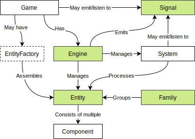

# Overview

One of typed-ecstasy's main advantages is its clean API, which makes it easy to use the right way and hard to break it. Let us take a look at how to use it, step by step. Bear in mind this is just a guide, for a complete API reference, please refer to the [API documentation](../../api/README.md).

First, make sure you understand what an [Entity Component System](../what-is-an-ecs.md) is.

Here is a simplified diagram that will help you understand typed-ecstasy's architecture:

The green parts are included in typed-ecstasy and you only need to create/configure instances. The other parts are partially included (except for the game) and need to be extended by you.

* An [Entity](entity.md) is no more than an id and a list of components.
* A [Component](component.md) represents a bag of data with no logic whatsoever.
* A [Family](family.md) is used to represent a set of entities with a specific collection of components.
* The [Engine](engine.md) is the core of the framework. It manages all entities and systems.
* In a [System](entitysystem.md) you can implement your game logic that may operate on entities of a given family.
* A [Signal](signal.md) allows you emit and connect to various events.
* An [EntityFactory](../data-driven/entityfactory.md) can be used to assemble entities using a [data-driven approach](../data-driven/README.md).
